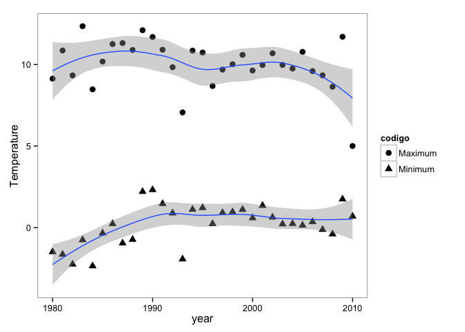
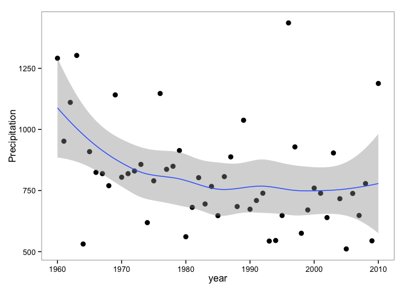

``` r
library('plyr')
library('dplyr')
```

    ## 
    ## Attaching package: 'dplyr'
    ## 
    ## The following objects are masked from 'package:plyr':
    ## 
    ##     arrange, count, desc, failwith, id, mutate, rename, summarise,
    ##     summarize
    ## 
    ## The following object is masked from 'package:stats':
    ## 
    ##     filter
    ## 
    ## The following objects are masked from 'package:base':
    ## 
    ##     intersect, setdiff, setequal, union

``` r
library("ggplot2")
library('broom') # tidy results
```

Prepare data
------------

``` r
# Prepare data
di <- '/Users/ajpelu/ownCloud/MS/CONGRESO_AEET2015/borreguiles/borreguiles_talk'

data <- read.csv(file=paste(di, '/data/climate_2300.csv', sep=''), header=TRUE, sep=";")

df <- tbl_df(data)
```

Explore data from 1980 to 2010
------------------------------

#### A plot of the evolution of temperatures from 1980 to 2010

``` r
ts_temp <- df %>% filter(ano >= 1980) %>%
  filter(codigo == 'tmin' | codigo == 'tmax') %>% 
  mutate(codigo = revalue(codigo, c("tmin" = "Minimum", "tmax" = "Maximum"))) %>% 
  mutate(valorC = valor / 10) %>%
  group_by(ano, codigo) %>%
  summarise_each(funs(mean, sd,se=sd(.)/sqrt(n())), valorC)
  
ggplot(ts_temp, aes(x=ano, y=mean, group=codigo)) + 
  geom_point(aes(group=codigo, shape=codigo), size=3) +
  geom_smooth(method='loess') +
  theme_bw() + xlab('year') + ylab('Temperature') + 
  theme(panel.background = element_blank(),
        panel.grid.major = element_blank(),
        panel.grid.minor = element_blank())  
```



#### A plot of the evolution of precipitation from 1950 to 2010

``` r
ts_precip <- df %>% 
  filter(codigo == 'precip') %>% 
  mutate(codigo = revalue(codigo, c("precip" = "Precipitation"))) %>% 
  group_by(ano, codigo) %>%
  summarise_each(funs(mean, sd,se=sd(.)/sqrt(n())), valor)
  
ggplot(ts_precip, aes(x=ano, y=mean)) + 
  geom_point(size=3) +
  geom_smooth(method='loess') + 
  theme_bw() + xlab('year') + ylab('Precipitation') + 
  theme(panel.background = element_blank(),
        panel.grid.major = element_blank(),
        panel.grid.minor = element_blank())  
```



Comparing results
-----------------

### Differences between decades

-   Diferences between 1980's and 2000's values of temperatures and precipitation
-   t-test \#\#\#\# Temperatures

``` r
# Temperatures for all pixels 
t80 <- df %>% 
  filter(ano >= 1980, ano <= 1990) %>%
  filter(codigo == 'tmin' | codigo == 'tmax') %>% 
  mutate(valorC = valor / 10) %>%
  group_by(cli_celda_id, codigo) %>%
  summarise_each(funs(mean, sd,se=sd(.)/sqrt(n())), valorC) 

t00 <- df %>% 
  filter(ano >= 2000, ano <= 2010) %>%
  filter(codigo == 'tmin' | codigo == 'tmax') %>% 
  mutate(valorC = valor / 10) %>%
  group_by(cli_celda_id, codigo) %>%
  summarise_each(funs(mean, sd,se=sd(.)/sqrt(n())), valorC) 

# T.test of tmin 
tmin80 <- t80 %>% filter(codigo == 'tmin')
tmin00 <- t00 %>% filter(codigo == 'tmin')

t.test(tmin80$mean, tmin00$mean, paired = TRUE) 
```

    ## 
    ##  Paired t-test
    ## 
    ## data:  tmin80$mean and tmin00$mean
    ## t = -560.6, df = 28049, p-value < 2.2e-16
    ## alternative hypothesis: true difference in means is not equal to 0
    ## 95 percent confidence interval:
    ##  -1.022 -1.015
    ## sample estimates:
    ## mean of the differences 
    ##                  -1.019

``` r
tidy(t.test(tmin80$mean, tmin00$mean, paired = TRUE))
```

    ##   estimate statistic p.value parameter conf.low conf.high
    ## 1   -1.019    -560.6       0     28049   -1.022    -1.015

``` r
# T.test of tmax 
tmax80 <- t80 %>% filter(codigo == 'tmax')
tmax00 <- t00 %>% filter(codigo == 'tmax')

t.test(tmax80$mean, tmax00$mean, paired = TRUE) 
```

    ## 
    ##  Paired t-test
    ## 
    ## data:  tmax80$mean and tmax00$mean
    ## t = 1465, df = 28049, p-value < 2.2e-16
    ## alternative hypothesis: true difference in means is not equal to 0
    ## 95 percent confidence interval:
    ##  1.137 1.140
    ## sample estimates:
    ## mean of the differences 
    ##                   1.139

``` r
tidy(t.test(tmax80$mean, tmax00$mean, paired = TRUE))
```

    ##   estimate statistic p.value parameter conf.low conf.high
    ## 1    1.139      1465       0     28049    1.137      1.14

``` r
# Get mean of 1980's 
mean80t <- df %>% 
  filter(ano >= 1980, ano <= 1990) %>%
  filter(codigo == 'tmin' | codigo == 'tmax') %>% 
  mutate(valorC = valor / 10) %>%
  group_by(codigo) %>%
  summarise_each(funs(mean, sd,se=sd(.)/sqrt(n())), valorC) %>%
    mutate(timerange = "1980's")

# Get mean of 2000's 
mean00t <- df %>% 
  filter(ano >= 2000, ano <= 2010)%>%
  filter(codigo == 'tmin' | codigo == 'tmax') %>% 
  mutate(valorC = valor / 10) %>%
  group_by(codigo) %>%
  summarise_each(funs(mean, sd,se=sd(.)/sqrt(n())), valorC) %>%
  mutate(timerange = "2000's")

mean10t <- rbind(mean80t, mean00t)
mean10t 
```

    ## Source: local data frame [4 x 5]
    ## 
    ##   codigo    mean    sd       se timerange
    ## 1   tmax 10.6903 2.284 0.004111    1980's
    ## 2   tmin -0.5267 2.129 0.003833    1980's
    ## 3   tmax  9.5514 2.524 0.004545    2000's
    ## 4   tmin  0.4920 1.675 0.003015    2000's

#### Precipitation

``` r
# Precipitation for all pixels 
p80 <- df %>% 
  filter(ano >= 1980, ano <= 1990) %>%
  filter(codigo == 'precip') %>%
  group_by(cli_celda_id) %>%
  summarise_each(funs(mean, sd,se=sd(.)/sqrt(n())), valor) 

p00 <- df %>% 
  filter(ano >= 2000, ano <= 2010) %>%
  filter(codigo == 'precip') %>%
  group_by(cli_celda_id) %>%
  summarise_each(funs(mean, sd,se=sd(.)/sqrt(n())), valor) 

# T.test of precip 
t.test(p80$mean, p00$mean, paired = TRUE) 
```

    ## 
    ##  Paired t-test
    ## 
    ## data:  p80$mean and p00$mean
    ## t = 17.94, df = 28049, p-value < 2.2e-16
    ## alternative hypothesis: true difference in means is not equal to 0
    ## 95 percent confidence interval:
    ##  6.300 7.845
    ## sample estimates:
    ## mean of the differences 
    ##                   7.072

``` r
tidy(t.test(p80$mean, p00$mean, paired = TRUE))
```

    ##   estimate statistic   p.value parameter conf.low conf.high
    ## 1    7.072     17.94 1.375e-71     28049      6.3     7.845

``` r
# Get mean of 1980's 
mean80p <- df %>% 
  filter(ano >= 1980, ano <= 1990) %>%
  filter(codigo == 'precip') %>%
  summarise_each(funs(mean, sd,se=sd(.)/sqrt(n())), valor) %>%
    mutate(timerange = "1980's")

# Get mean of 2000's 
mean00p <- df %>% 
  filter(ano >= 2000, ano <= 2010)%>%
  filter(codigo == 'precip') %>%
  summarise_each(funs(mean, sd,se=sd(.)/sqrt(n())), valor) %>%
  mutate(timerange = "2000's")

mean10p <- rbind(mean80p, mean00p)
mean10p 
```

    ## Source: local data frame [2 x 4]
    ## 
    ##    mean    sd     se timerange
    ## 1 749.6 166.6 0.2999    1980's
    ## 2 742.5 187.1 0.3368    2000's

### Differences between quinquenniums

-   Diferences between 1985-1990's and 2005-2010's values of temperatures and precipitation
-   t-test \#\#\#\# Temperatures

``` r
# Temperatures for all pixels 
t85 <- df %>% 
  filter(ano >= 1985, ano <= 1990) %>%
  filter(codigo == 'tmin' | codigo == 'tmax') %>% 
  mutate(valorC = valor / 10) %>%
  group_by(cli_celda_id, codigo) %>%
  summarise_each(funs(mean, sd,se=sd(.)/sqrt(n())), valorC) 

t05 <- df %>% 
  filter(ano >= 2005, ano <= 2010) %>%
  filter(codigo == 'tmin' | codigo == 'tmax') %>% 
  mutate(valorC = valor / 10) %>%
  group_by(cli_celda_id, codigo) %>%
  summarise_each(funs(mean, sd,se=sd(.)/sqrt(n())), valorC) 

# T.test of tmin 
tmin85 <- t85 %>% filter(codigo == 'tmin')
tmin05 <- t05 %>% filter(codigo == 'tmin')

t.test(tmin85$mean, tmin05$mean, paired = TRUE) 
```

    ## 
    ##  Paired t-test
    ## 
    ## data:  tmin85$mean and tmin05$mean
    ## t = 29.48, df = 28049, p-value < 2.2e-16
    ## alternative hypothesis: true difference in means is not equal to 0
    ## 95 percent confidence interval:
    ##  0.05038 0.05756
    ## sample estimates:
    ## mean of the differences 
    ##                 0.05397

``` r
tidy(t.test(tmin85$mean, tmin05$mean, paired = TRUE))
```

    ##   estimate statistic    p.value parameter conf.low conf.high
    ## 1  0.05397     29.48 3.634e-188     28049  0.05038   0.05756

``` r
# T.test of tmax 
tmax85 <- t85 %>% filter(codigo == 'tmax')
tmax05 <- t05 %>% filter(codigo == 'tmax')

t.test(tmax85$mean, tmax05$mean, paired = TRUE) 
```

    ## 
    ##  Paired t-test
    ## 
    ## data:  tmax85$mean and tmax05$mean
    ## t = 1762, df = 28049, p-value < 2.2e-16
    ## alternative hypothesis: true difference in means is not equal to 0
    ## 95 percent confidence interval:
    ##  2.062 2.067
    ## sample estimates:
    ## mean of the differences 
    ##                   2.064

``` r
tidy(t.test(tmax85$mean, tmax05$mean, paired = TRUE))
```

    ##   estimate statistic p.value parameter conf.low conf.high
    ## 1    2.064      1762       0     28049    2.062     2.067

``` r
# Get mean of 1985-1990
mean85t <- df %>% 
  filter(ano >= 1985, ano <= 1990) %>%
  filter(codigo == 'tmin' | codigo == 'tmax') %>% 
  mutate(valorC = valor / 10) %>%
  group_by(codigo) %>%
  summarise_each(funs(mean, sd,se=sd(.)/sqrt(n())), valorC) %>%
    mutate(timerange = "1985's")

# Get mean of 2005-2010 
mean05t <- df %>% 
  filter(ano >= 2005, ano <= 2010)%>%
  filter(codigo == 'tmin' | codigo == 'tmax') %>% 
  mutate(valorC = valor / 10) %>%
  group_by(codigo) %>%
  summarise_each(funs(mean, sd,se=sd(.)/sqrt(n())), valorC) %>%
  mutate(timerange = "2005's")

meanQuint <- rbind(mean85t, mean05t)
meanQuint 
```

    ## Source: local data frame [4 x 5]
    ## 
    ##   codigo    mean    sd       se timerange
    ## 1   tmax 11.2398 1.975 0.004815    1985's
    ## 2   tmin  0.4526 2.007 0.004891    1985's
    ## 3   tmax  9.1755 2.867 0.006987    2005's
    ## 4   tmin  0.3986 1.680 0.004096    2005's

#### Precipitation

``` r
# Precipitation for all pixels 
p85 <- df %>% 
  filter(ano >= 1985, ano <= 1990) %>%
  filter(codigo == 'precip') %>%
  group_by(cli_celda_id) %>%
  summarise_each(funs(mean, sd,se=sd(.)/sqrt(n())), valor) 

p05 <- df %>% 
  filter(ano >= 2005, ano <= 2010) %>%
  filter(codigo == 'precip') %>%
  group_by(cli_celda_id) %>%
  summarise_each(funs(mean, sd,se=sd(.)/sqrt(n())), valor) 

# T.test of precip 
t.test(p85$mean, p05$mean, paired = TRUE) 
```

    ## 
    ##  Paired t-test
    ## 
    ## data:  p85$mean and p05$mean
    ## t = 109.4, df = 28049, p-value < 2.2e-16
    ## alternative hypothesis: true difference in means is not equal to 0
    ## 95 percent confidence interval:
    ##  53.96 55.93
    ## sample estimates:
    ## mean of the differences 
    ##                   54.94

``` r
tidy(t.test(p85$mean, p05$mean, paired = TRUE))
```

    ##   estimate statistic p.value parameter conf.low conf.high
    ## 1    54.94     109.4       0     28049    53.96     55.93

``` r
# Get mean of 1985-1990 
mean85p <- df %>% 
  filter(ano >= 1985, ano <= 1990) %>%
  filter(codigo == 'precip') %>%
  summarise_each(funs(mean, sd,se=sd(.)/sqrt(n())), valor) %>%
    mutate(timerange = "1985's")

# Get mean of 2005-2010 
mean05p <- df %>% 
  filter(ano >= 2005, ano <= 2010)%>%
  filter(codigo == 'precip') %>%
  summarise_each(funs(mean, sd,se=sd(.)/sqrt(n())), valor) %>%
  mutate(timerange = "2005's")

meanQuinp <- rbind(mean85p, mean05p)
meanQuinp 
```

    ## Source: local data frame [2 x 4]
    ## 
    ##    mean    sd     se timerange
    ## 1 789.7 187.7 0.4576    1985's
    ## 2 734.8 233.6 0.5695    2005's
