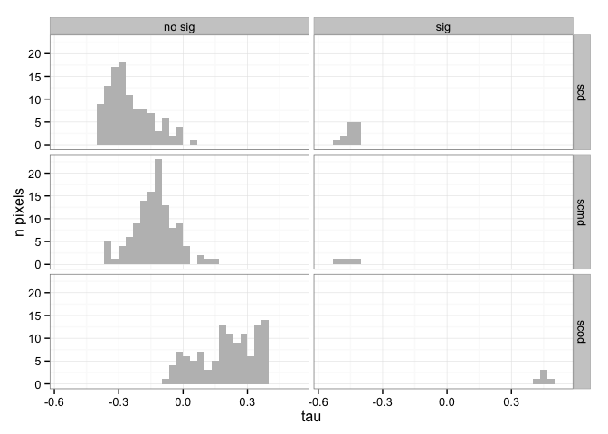

``` r
library("dplyr")
```

    ## 
    ## Attaching package: 'dplyr'
    ## 
    ## The following object is masked from 'package:stats':
    ## 
    ##     filter
    ## 
    ## The following objects are masked from 'package:base':
    ## 
    ##     intersect, setdiff, setequal, union

``` r
library('plyr')
```

    ## -------------------------------------------------------------------------
    ## You have loaded plyr after dplyr - this is likely to cause problems.
    ## If you need functions from both plyr and dplyr, please load plyr first, then dplyr:
    ## library(plyr); library(dplyr)
    ## -------------------------------------------------------------------------
    ## 
    ## Attaching package: 'plyr'
    ## 
    ## The following objects are masked from 'package:dplyr':
    ## 
    ##     arrange, count, desc, failwith, id, mutate, rename, summarise,
    ##     summarize

``` r
library("ggplot2")
library('devtools')
```

    ## 
    ## Attaching package: 'devtools'
    ## 
    ## The following objects are masked from 'package:utils':
    ## 
    ##     ?, help
    ## 
    ## The following object is masked from 'package:base':
    ## 
    ##     system.file

``` r
source_url('https://raw.githubusercontent.com/ajpelu/ajpeluR/master/R/exploreMKTS.R') # Export function 
```

    ## SHA-1 hash of file is fbb8c444960013de7507608370fefd2952de7a22

### Prepare date

``` r
### Prepare data
## Read data of snow cover indicators 
di <- '/Users/ajpelu/ownCloud/MS/DOSSIER2013_FICHAS/NIEVE/ts_snow_dossier'

## Loop to read indicators csv files and change variable names
indicadores <- c('scd', 'scod', 'scmd')
for (j in indicadores) {
  # read data
  aux <- read.csv(file=paste(di, '/data/', j, '.csv', sep=''), header=T, sep=';')
  # change variable names
  names(aux) <- c('sen_slope','sen_slope_pct', 'p_value', 'S', 'varS', 'miss', 'tau', 'nie_malla_modi_id')
  # Classify the p_value 
  aux$sig <- ifelse(aux$p_value <= 0.05, 'sig', 'no sig') 
  # Add a column with variable name 
  aux$variable <- rep(j, nrow(aux))
  # Assign output to an dataframe
  assign(paste('raw_',j,sep=''), aux)
  # remove aux object 
  rm(aux)
}


## Get trends info only for pixels of San Juan Basin

# id of pixels nie_malla_modis
pixels_borreguiles <- c(1671139,1671140,1671141,1671142,1671143,1671144,1671145,1671146,1671147,1671148,1673541,1673542,1673543,1673544,1673545,1673546,1673547,1673548,1673549,1673550,1675943,1675944,1675945,1675946,1675947,1675948,1675949,1675950,1675951,1675952,1678345,1678346,1678347,1678348,1678349,1678350,1678351,1678352,1678353,1678354,1680747,1680748,1680749,1680750,1680751,1680752,1680753,1680754,1680755,1680756,1683149,1683150,1683151,1683152,1683153,1683154,1683155,1683156,1683157,1683158,1685551,1685552,1685553,1685554,1685555,1685556,1685557,1685558,1685559,1685560,1687953,1687954,1687955,1687956,1687957,1687958,1687959,1687960,1687961,1687962,1690355,1690356,1690357,1690358,1690359,1690360,1690361,1690362,1690363,1690364,1692757,1692758,1692759,1692760,1692761,1692762,1692763,1692764,1692765,1692766,1695159,1695160,1695161,1695162,1695163,1695164,1695165,1695166,1695167,1695168,1697561,1697562,1697563,1697564,1697565,1697566,1697567,1697568,1697569,1697570)


## Select 
scd <- raw_scd %>% 
  filter(nie_malla_modi_id %in% pixels_borreguiles)

scod <- raw_scod %>% 
  filter(nie_malla_modi_id %in% pixels_borreguiles)

scmd <- raw_scmd %>% 
  filter(nie_malla_modi_id %in% pixels_borreguiles)
```

### Explore trends

``` r
# Explore Trends 
exp_scd <- exploreMKTS(scd, alpha=0.05)
exp_scod <- exploreMKTS(scod, alpha=0.05)
exp_scmd <- exploreMKTS(scmd, alpha=0.05)


# Create table with all resuls 
# tau_pos
tau_pos <- rbind(
cbind(exp_scd$summary[1,c(2,3)],variable='scd'),
cbind(exp_scod$summary[1,c(2,3)],variable='scod'),
cbind(exp_scmd$summary[1,c(2,3)],variable='scmd'))
names(tau_pos) <- c('tau_pos_n','tau_pos_%','variable')

# tau_pos_sig
tau_pos_sig <- rbind(
  cbind(exp_scd$summary[2,c(2,3)],variable='scd'),
  cbind(exp_scod$summary[2,c(2,3)],variable='scod'),
  cbind(exp_scmd$summary[2,c(2,3)],variable='scmd'))
names(tau_pos_sig) <- c('tau_pos_sig_n','tau_pos_sig_%','variable')

# tau_neg
tau_neg <- rbind(
  cbind(exp_scd$summary[3,c(2,3)],variable='scd'),
  cbind(exp_scod$summary[3,c(2,3)],variable='scod'),
  cbind(exp_scmd$summary[3,c(2,3)],variable='scmd'))
names(tau_neg) <- c('tau_neg_n','tau_neg_%','variable')

# tau_pos_sig
tau_neg_sig <- rbind(
  cbind(exp_scd$summary[4,c(2,3)],variable='scd'),
  cbind(exp_scod$summary[4,c(2,3)],variable='scod'),
  cbind(exp_scmd$summary[4,c(2,3)],variable='scmd'))
names(tau_neg_sig) <- c('tau_neg_sig_n','tau_neg_sig_%','variable')

# Table with all the results 
summ_explore <- inner_join(
  inner_join(tau_pos, tau_pos_sig, by='variable'),
  inner_join(tau_neg, tau_neg_sig, by='variable'), by='variable')
  
# Reorder variables
summ_explore <- summ_explore[,c(3,1:2,4:9)]
summ_explore
```

    ##   tau_pos_% variable tau_pos_n tau_pos_sig_n tau_pos_sig_% tau_neg_n
    ## 1      0.83      scd         1             0             0       119
    ## 2        90     scod       108             5          4.63        12
    ## 3         5     scmd         6             0             0       112
    ##   tau_neg_% tau_neg_sig_n tau_neg_sig_%
    ## 1     99.17            13         10.92
    ## 2        10             0             0
    ## 3     93.33             4          3.57

### histograma de las tendencias

``` r
# Histogram of tau values classified into signiticatives or not, and by indicator  
# Create a dataframe with results of all indicators and remove incomplete cases. 
all_ind <- rbind(scd,scod,scmd)
all_ind <- all_ind[complete.cases(all_ind),]

ggplot(all_ind, aes(x=tau)) + geom_histogram(stat='bin', bindwidth=.1, fill='grey') + 
  facet_grid(variable~sig) + theme_bw() + ylab('n pixels')
```

    ## stat_bin: binwidth defaulted to range/30. Use 'binwidth = x' to adjust this.
    ## stat_bin: binwidth defaulted to range/30. Use 'binwidth = x' to adjust this.
    ## stat_bin: binwidth defaulted to range/30. Use 'binwidth = x' to adjust this.
    ## stat_bin: binwidth defaulted to range/30. Use 'binwidth = x' to adjust this.
    ## stat_bin: binwidth defaulted to range/30. Use 'binwidth = x' to adjust this.
    ## stat_bin: binwidth defaulted to range/30. Use 'binwidth = x' to adjust this.



### Mean values of tau and slopes

``` r
# 
summ_slopes_tau <- all_ind %>% 
  group_by(variable) %>%
  summarise_each(funs(mean, sd,se=sd(.)/sqrt(n())), c(sen_slope, tau))

summ_slopes_tau
```

    ## Source: local data frame [3 x 7]
    ## 
    ##   variable sen_slope_mean tau_mean sen_slope_sd tau_sd sen_slope_se
    ## 1      scd         -2.620  -0.2708       1.0764 0.1148      0.09826
    ## 2     scmd         -1.182  -0.1467       1.0788 0.1119      0.09848
    ## 3     scod          1.191   0.2169       0.8106 0.1394      0.07400
    ## Variables not shown: tau_se (dbl)
